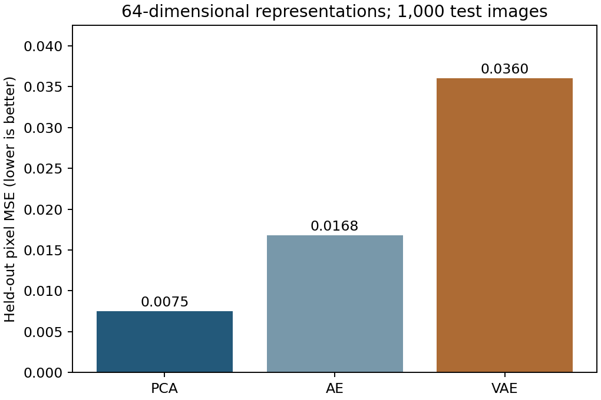

# Methods and interpretation

## Question

How do PCA, a dense autoencoder, and a variational autoencoder compare at the same latent dimension?

## Data

10,000 grayscale images. Use your authorized CelebA image directory. The local benchmark uses the first 10,000 filenames in sorted order from the supplied archive, resized to 64 × 64 grayscale and scaled to [0, 1]. Obtain images from the original provider under its terms; images and model weights are not included.

## Analysis

Added a reproducible 80/10/10 split, matched latent dimensions, validation-based checkpoint selection, and a common held-out pixel MSE. Synthetic smoke-test artifacts are kept private and never reported as image-dataset performance.

The entry point is `analysis.py`. Parameters and analysis cohorts are recorded in the code and result files.

## Findings

The revised experiment uses 8,000 training, 1,000 validation, and 1,000 test images, with 64 latent dimensions and ten training epochs. Held-out pixel MSE was 0.00750 for PCA, 0.01677 for the autoencoder, and 0.03600 for the VAE. PCA performed best under this training budget and metric. No images or fitted weights are distributed.

## Limits

The original notebook showed training-image reconstructions at unequal latent dimensions. The revised experiment is a separate controlled comparison, not confirmation of those original results. Random image splits do not ensure identity separation in CelebA. Pixel MSE does not measure perceptual quality or privacy. The VAE is evaluated at its posterior mean.

## Result files

- [ae-history.csv](results/ae-history.csv)
- [reconstruction-comparison.png](results/reconstruction-comparison.png)
- [reconstruction-metrics.csv](results/reconstruction-metrics.csv)
- [run.json](results/run.json)
- [vae-history.csv](results/vae-history.csv)
Source context: [https://mmlab.ie.cuhk.edu.hk/projects/CelebA.html](https://mmlab.ie.cuhk.edu.hk/projects/CelebA.html)

